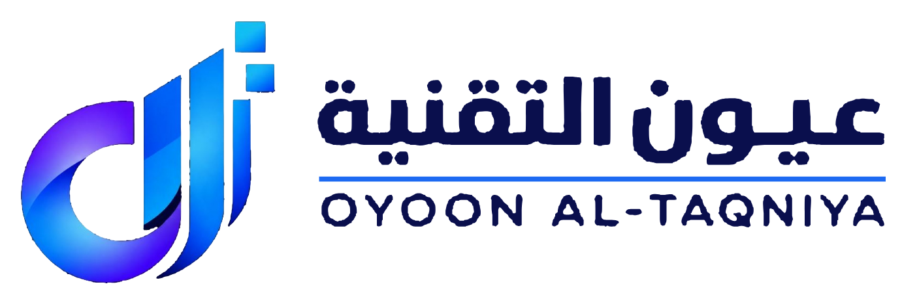
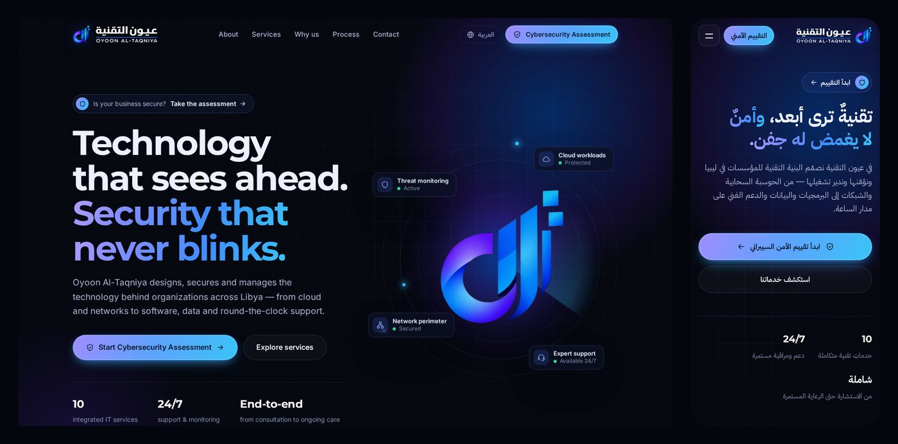

<p align="center">
  <picture>
    <source media="(prefers-color-scheme: dark)" srcset="assets/img/logo/oyoon-logo-horizontal-white.png">
    
  </picture>
</p>

<h3 align="center">Oyoon Al-Taqniya · عيون التقنية للاتصالات وتقنية المعلومات</h3>
<p align="center">Website for Oyoon Al-Taqniya Telecommunications &amp; IT (techeyes.ly), Tripoli, Libya</p>



A premium, bilingual (English / العربية) single-page site built around the company's logo,
with a prominent **Cybersecurity Assessment** call to action that sends visitors to
**https://cta.techeyes.ly**.

- **Brand:** the Oyoon Al-Taqniya logo in the header, hero, about card, closing banner and footer
  (the footer shows the complete stacked logo). The site colours are sampled from it. In the hero
  the mark floats and tilts in 3D toward the visitor's pointer.
- **Cybersecurity Assessment:** in the header, the hero, a dedicated assessment section, the
  cybersecurity service card, the closing banner and the footer. `techeyes.ly/assessment` is also a
  short link that redirects to the portal.
- **Bilingual with full RTL:** language switch in the header. The choice is remembered, and Arabic
  browsers open in Arabic. `?lang=ar` / `?lang=en` links work too.
- **Fast and private:** plain HTML/CSS/JS with no build step and no frameworks. Fonts are
  self-hosted, and the site makes no third-party requests.
- **Accessible:** semantic landmarks, keyboard-friendly menu, visible focus, `prefers-reduced-motion`
  support, and no axe-core (WCAG 2.1 AA) violations in either language.
- **Hardened:** a strict Content-Security-Policy and security headers for Cloudflare Pages
  (`_headers`) and Apache (`.htaccess`).

## Project structure

```
index.html                 The page. English copy lives here.
404.html                   Not-found page
assessment/index.html      /assessment → https://cta.techeyes.ly (fallback for static hosts)
assets/
  css/styles.css           Design system + all styles (tokens at the top)
  js/boot.js               Sets language/direction before first paint
  js/i18n.js               Arabic translations (keys match data-i18n in index.html)
  js/main.js               Menu, language switch, reveal animations, watching eyes, form
  fonts/                   Montserrat, Inter, IBM Plex Sans Arabic (SIL OFL, see licenses/)
  img/logo/                Logo files (see "Logo files" below)
  img/                     Favicons, app icons, social share image (og-image.png)
_headers, _redirects       Cloudflare Pages / Netlify config
.htaccess                  Same config for Apache / LiteSpeed (cPanel) hosting
tools/check-i18n.mjs       Checks that every English string has an Arabic translation
```

## Run locally

Any static file server works:

```bash
python3 -m http.server 8080     # or: npx serve .
# open http://localhost:8080  (Arabic: http://localhost:8080/?lang=ar)
```

## Editing content

- **English text:** edit it directly in `index.html`.
- **Arabic text:** every translatable element has a `data-i18n="key"`. Put the Arabic for that key
  in `assets/js/i18n.js`. After adding or renaming keys, run:

  ```bash
  node tools/check-i18n.mjs
  ```

- **Assessment link:** `https://cta.techeyes.ly` appears in `index.html`, `404.html`,
  `assessment/index.html`, `_redirects` and `.htaccess`.
- **Contact details:** phone, email and address are in `index.html` (including the structured data
  in `<head>`). The contact form's recipient is the `EMAIL` constant in `assets/js/main.js`.
- **Contact form:** it opens the visitor's email app with the message pre-filled (`mailto:`), so no
  backend is needed. To collect submissions on a server instead, point the form at a form service
  or a Cloudflare Worker, and add that origin to the CSP `connect-src` / `form-action`.
- **Brand colors:** the tokens at the top of `styles.css`, sampled from the logo: violet `#6A27FA`,
  royal blue `#0165F9` and sky `#2FB6F8`.

## Logo files

`assets/img/logo/` was produced from the supplied logo artwork:

| File | Use |
| --- | --- |
| `oyoon-logo.png` / `oyoon-logo-white.png` | Full stacked logo (as supplied): navy text for light backgrounds, white text for dark |
| `oyoon-logo-horizontal.png` / `-white.png` | Mark beside the name, for documents and headers |
| `oyoon-mark.png` | The mark alone, transparent background |
| `oyoon-wordmark.svg` / `-white.svg` | Vector lettering: عيون التقنية, rule, OYOON AL-TAQNIYA |
| `oyoon-mark-fill.jpg` | Texture the website clips with a vector outline so the mark stays sharp at large sizes |

The lettering is traced to vector. The mark keeps the original's shading, taken from the
1080 × 810 source image. If you have the logo as an SVG, AI or EPS file, send it over and
the mark can be swapped for a pure vector version.

## Deploying

The site is fully static: deploy the repository root as-is. No build command is needed.

| Host | How | `/assessment` redirect & security headers |
| --- | --- | --- |
| **Cloudflare Pages** (recommended, since the domain already uses Cloudflare) | Connect this repo, leave the build command empty, output directory `/`. Add `techeyes.ly` as a custom domain. | `_redirects` and `_headers` apply automatically |
| **Existing cPanel / Apache hosting** | Upload the files to the web root, replacing the old WordPress site. | `.htaccess` |
| **GitHub Pages** | Settings → Pages → deploy from this branch, root folder. | Meta-refresh fallback in `assessment/index.html`. Custom headers are not supported. |

If you add analytics, a chat widget or anything else that loads from another domain, add that
origin to the `Content-Security-Policy` in `_headers` / `.htaccess`. Cloudflare Web Analytics is
already allowed. Keep Cloudflare **Rocket Loader** off: it rewrites scripts in a way the CSP blocks.
